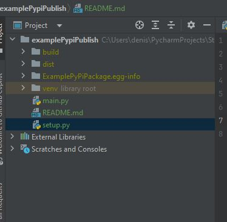

## Step 1

Run 

python setup.py sdist bdist_wheel. 

Generates
- build
- dist
- egg info

## Step 2

Install twine
`pip install twine`

Pypi needs two registered accounts at
- https://test.pypi.org/account/register/ (Optional)
- https://pypi.org/account/register/

Enable 2 factor auth
Go to https://pypi.org/manage/account/

Generate api token in Pypi (Requires 2 factor auth)
Go to https://pypi.org/manage/account/

Note that you can just use password -> issue is how do i have multiple users for a pypi account (Bus problem)

## Step 3 a

Upload to test pypi (Not necessary, testing only)

**Use this for prompt username and password**

`twine upload -r testpypi dist/*`

**Use this to upload**

`twine upload -r testpypi dist/* --username __token__ --password <test pypi api token>` OR

`twine upload -r testpypi dist/* --username <username test pypi> --password <TestPypi Password>` OR

`twine upload -r testpypi dist/*` with a .pypirc file in $HOME

View at
https://test.pypi.org/project/ExamplePyPiPackage/0.1.0/

## Step 3 b

Upload to test pypi (Not necessary, testing only)

`twine upload dist/*`

Use similar arguments as test. Separate api key is needed.

## Private repository and twine
- Update the .pypirc with repo OR
- use --repository option with twin

## Reference

Setup Private Repository https://blog.xelnor.net/private-pypi/